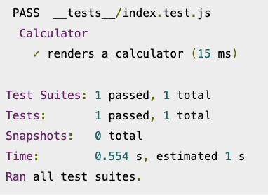
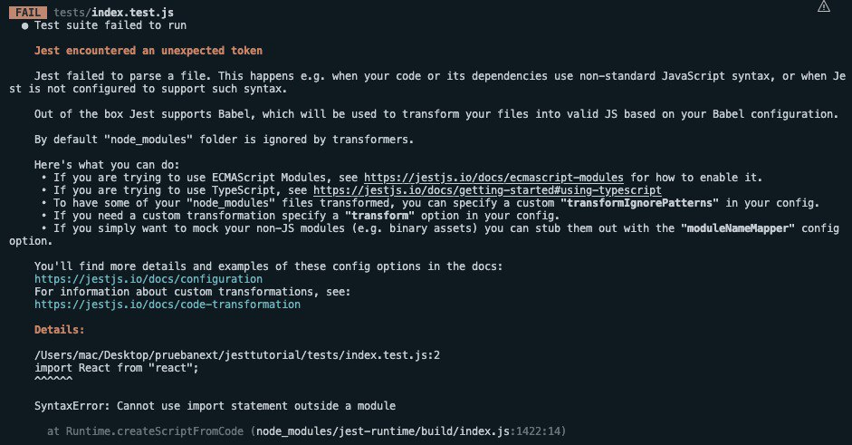
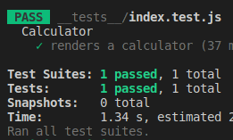
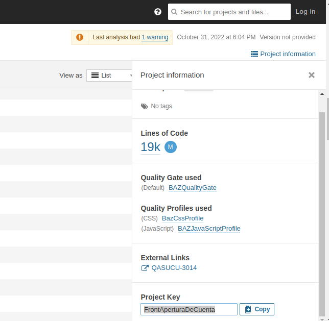
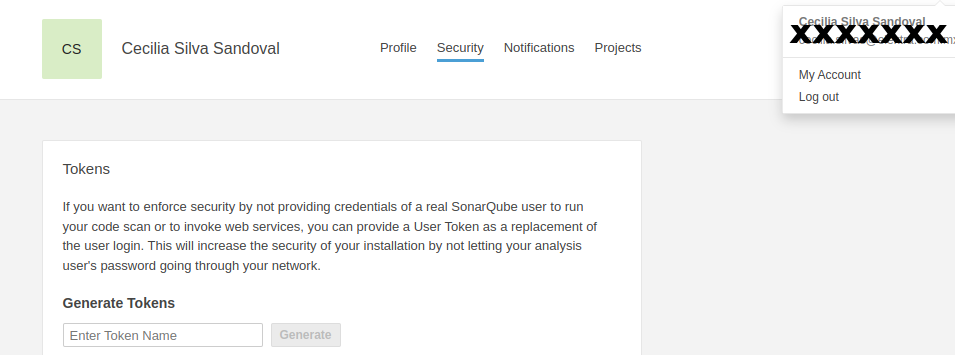

#  ✨Configuracion de SonarQube para covertura en Javascript (_Nextjs y JEST_ ) ✨
## Configurando Jest 

Conocimiento necesario:
- Javascript
- ReactJS, NextJS
- Pruebas con Jest
- Instalación de paquetes y manejo de terminal
- Proyecto ya configurado en SonarQube

Para configurar Jest, necesitamos instalar algunos paquetes necesarios: 
```
npm install --save-dev jest eslint-plugin-testing-library @testing-library/react @testing-library/jest-dom @testing-library/user-event jest-environment-jsdom identity-obj-proxy
```

Ahora, crearemos un nuevo archivo para almacenar nuestra configuración de Jest. En la carpeta raíz del proyecto, crea un nuevo archivo llamado jest.config.js con la siguiente configuración (configuracion de la documentación oficial de NextJS):

jest.config.js
```plain
// You can learn more about each option below in the Jest docs: https://jestjs.io/docs/configuration.
module.exports = {
    verbose: true,
    collectCoverageFrom: [
      '**/*.{js,jsx,ts,tsx}',
      '!**/*.d.ts',
      '!**/node_modules/**',
    ],
    moduleNameMapper: {
      // Handle CSS imports (with CSS modules)
      // https://jestjs.io/docs/webpack#mocking-css-modules
      '^.+\\.module\\.(css|sass|scss)$': 'identity-obj-proxy',
  
      // Handle CSS imports (without CSS modules)
      '^.+\\.(css|sass|scss)$': '<rootDir>/__mocks__/styleMock.js',
  
      // Handle image imports
      // https://jestjs.io/docs/webpack#handling-static-assets
      '^.+\\.(png|jpg|jpeg|gif|webp|avif|ico|bmp|svg)$': `<rootDir>/__mocks__/fileMock.js`,
  
      // Handle module aliases
      '^@/components/(.*)$': '<rootDir>/components/$1',
      '^@/pages/(.*)$': '<rootDir>/pages/$1',
    },
    setupFilesAfterEnv: ['<rootDir>/jest.setup.js'],
    testPathIgnorePatterns: ['<rootDir>/node_modules/', '<rootDir>/.next/'],
    transform: {
      // Use babel-jest to transpile tests with the next/babel preset
      // https://jestjs.io/docs/configuration#transform-objectstring-pathtotransformer--pathtotransformer-object
      '\\.[jt]sx?$': ['babel-jest', { presets: ['next/babel'] }],
    },
    transformIgnorePatterns: [
      '/node_modules/',
      '^.+\\.module\\.(css|sass|scss)$',
    ],
    testEnvironment: 'jest-environment-jsdom',
  };

```

Crea el archivo jest.setup.js

```plain
// Opcional: configure o configure un marco de prueba antes de cada prueba.
// Si elimina este archivo, elimine `setupFilesAfterEnv` de `jest.config.js`
// La biblioteca @testing-library/jest-dom proporciona un conjunto de comparadores de jest personalizados que puede usar para extender jest.
// Esto hará que sus pruebas sean más declarativas, fáciles de leer y de mantener.
// https://github.com/testing-library/jest-dom
import '@testing-library/jest-dom/extend-expect'
```

Modifica tu package.json y agrega el test (revisa la bandera --watch):
```
"scripts": {
    "dev": "next dev",
    "build": "next build",
    "start": "next start -p 8087",
    "lint": "next lint",
    "test": "jest"
  },
 ```
 
Ahora que nuestras configuraciones están listas, podemos avanzar con las pruebas de escritura.

# Probando una aplicación de Next.js con Jest
En el directorio raíz del proyecto, crearemos una nueva carpeta llamada  _( _ _ tests _ _ )_ , que Jest usará para buscar pruebas. Dentro de la misma carpeta crea un nuevo archivo llamado index.test.js. (archivo donde escribiremos nuestras pruebas https://jestjs.io/docs/getting-started ) 

Proyecto de apoyo: https://blog.logrocket.com/testing-next-js-apps-jest/

Ejecutamos el comando para hacer el testeo:
 ```
 npm test
  ```
  
Podemos tener un resultado como el siguiente:   



# **CONFIGURACON ADICIONAL**
## Agregando [Babel](https://jestjs.io/es-ES/docs/code-transformation) a nuestra configuración
Babel es un compilador de JavaScript, es un conjunto de herramientas que se utiliza principalmente para convertir el código ECMAScript 2015+ en una versión retrocompatible de JavaScript en navegadores o entornos actuales y antiguos. Lo cual será necesario para transpilar `node_modules` y para poder solucionar este posible error (Ve https://babeljs.io/docs/en/next/config-files  y  https://archive.jestjs.io/docs/es-es/23.x/getting-started#using-babel para más información):




Agregaremos el archivo `.babelrc` en el directorio raíz de tu proyecto, con el siguiente contenido e instala las siguientes dependencias:
```
npm i --save-dev @babel/plugin-transform-runtime @babel/preset-env @babel/preset-react @babel/runtime  babel-jest
```
```
{
    "presets": [
        "@babel/preset-env",
       ["@babel/preset-react", {"runtime": "automatic"}]
    ],
    "plugins": [
        ["@babel/plugin-transform-runtime",
          {
            "regenerator": true
          }
        ]
    ]
}
```
> Note:  Jest ejecuta el código en su proyecto JavaScript, pero si utilizas alguna sintaxis no compatible con Node de forma nativa (como JSX, TypeScript, Vue template), entonces debes transformar ese código en JavaScript plano, similar a lo que harías al compilar para el Navegador. Esta es una yuda que nos ofrece Babel.

Para este punto tu `npm test` debe funcionar correctamente:   



# Configuración SonarQube
En el archivo comprimido con nombre `sonar-scanner.zip` entra a directorio
sonar-scanner/conf/sonar-scanner.properties , este sera el directorio donde podremos poner nuestras configuraciones, pero debemos cambiarlas cada que subamos un proyecto pues son globales o en su defecto colocar la configuracion en terminal:

> **sonar-scanner.properties vs sonar-project.properties**
Puede poner los mismos valores en ambos, pero no debería hacerlo. El archivo sonar-scanner.properties está a nivel de servidor y solo debe contener valores que sean correctos para todos los proyectos, como el valor sonar.host.url.
Por otro lado, sonar-project.properties es un archivo a nivel de proyecto y debe contener valores específicos del proyecto, como la ubicación de cada proyecto sonar.sources y sonar.projectKey, etc.

## Propiedades a configurar en tu proyecto
- sonar.projectKey = projectKey es simplemente el identificador único de tu proyecto dentro de SonarQube. Eres libre de elegir lo que quieras, siempre que sea único. Lo encontrarás al final del scroll de tu Project Information    

- sonar.sources = Se refere a los archivos que se van a tener en cuenta al ejecutar el sonar, por default se ocupa  `sonar.sources=.`, o src en el caso de ser una app React, para el caso de Next , especifica las rutas a las que se aplicara la covertura, por ejemplo: `sonar.sources = ./components,./pages,...`
- sonar.host.url = Se refiere al host y puerto de tu sonar, por ejemplo: `sonar.host.url = http://10.10.10.51:5000 `
- sonar.login = Si desea reforzar la seguridad al no proporcionar las credenciales de un usuario real de SonarQube para ejecutar su escaneo de código o invocar los servicios web, puede proporcionar un token de usuario como reemplazo del inicio de sesión del usuario. Esto aumentará la seguridad de su instalación al no dejar pasar su contraseña de usuario de análisis por su red. Para generarlo, selecciona tu usuario y en el aparado account, selecciona security y genera tu token , se debe ver de la siguiente forma: `sonar.login=8592b1361234567216x55b09b7897290prueba44a0` 
- sonar.javascript.lcov.reportPaths = SonarQube admite la generación de informes de información de cobertura de prueba como parte del análisis de su proyecto JS/TS. Sin embargo, no genera el informe de cobertura por sí mismo. En su lugar, debe configurar una herramienta de terceros para producir el informe como parte de su proceso de creación. Luego debe configurar su análisis para decirle a SonarScanner dónde se encuentra el informe para que pueda recogerlo y enviarlo a SonarQube, donde se mostrará en el tablero de su proyecto junto con las otras métricas de análisis. Este campo se llena con la ubicacion del archivo, por ejemplo: `sonar.javascript.lcov.reportPaths=coverage/lcov.info`, y este se obtiene al installar globalmente jest con el comando; `npm install jest --global `, y ejecutando en la terminal el comando : `jest --coverage --outputFile=coverage`, donde coverage hace referencia a a la carpeta que se creará gracias al comando, y donde encontraremos el archivo `lcov.info` anteriormente mencionado.
- sonar.coverage.exclusions = Se recomiend excluir la carpeta donde realizaras las pruebas `sonar.coverage.exclusions=./__tests__/*`.


Una vez tu configuración esta lista , tienes la opción de colocarla en tu sonar-scanner.properties o escribirla directamente en línea de comandos con la siguiente sintaxis: 
```
<nombre de la ubicacion de tu archivo exportado (sonar-scanner, ej: /Users/cmaldonador/Desarrollo/sonar-scanner/bin/sonar-scanner)> -Dsonar.projectKey=<tu-projectKey> -Dsonar.sources=<tus-sources> -Dsonar.host.url=<tu-host.url> -Dsonar.login=<tu-login> -Dsonar.javascript.lcov.reportPaths=<tu-lcov.info> -Dsonar.coverage.exclusions=<tu-tests>
```

# ¡ Listo tu proyecto tiene covertura !

